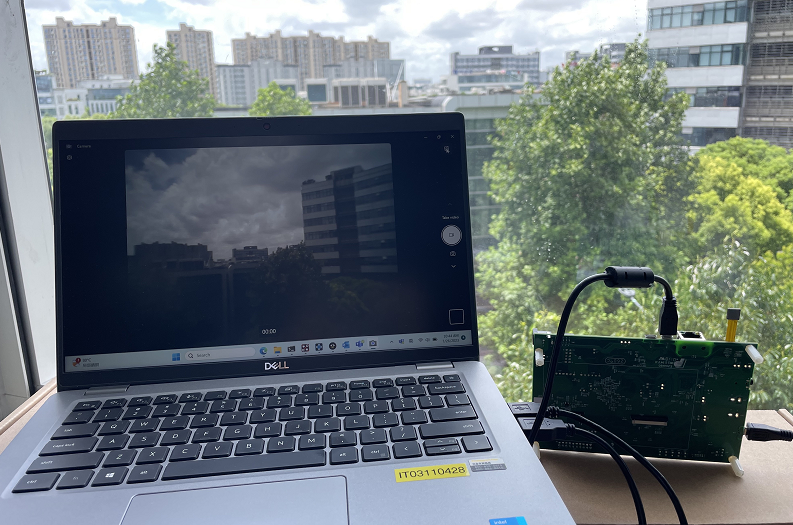
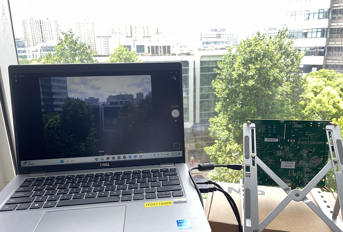

# NXP Application Code Hub
[](https://www.nxp.com)

## AN12103: Developing a simple UVC device based on i.MX RT1050
This document describes how to develop a simple UVC device using the NXP i.MX RT1050 or i.MX RT1170 processor.

Please refer to [AN12103](https://www.nxp.com/docs/en/application-note/AN12103.pdf) for complete instructions on how to use this software. 

#### Boards: [EVK-MIMXRT1050](https://www.nxp.com/design/development-boards/i-mx-evaluation-and-development-boards/i-mx-rt1050-evaluation-kit:MIMXRT1050-EVK), [EVKB-IMXRT1050](https://www.nxp.com/design/development-boards/i-mx-evaluation-and-development-boards/i-mx-rt1050-evaluation-kit:MIMXRT1050-EVK), [MIMXRT1170-EVK](https://www.nxp.com/design/development-boards/i-mx-evaluation-and-development-boards/i-mx-rt1170-evaluation-kit:MIMXRT1170-EVK), [MIMXRT1170-EVKB](https://www.nxp.com/design/development-boards/i-mx-evaluation-and-development-boards/i-mx-rt1170-evaluation-kit:MIMXRT1170-EVK)
#### Categories: Vision, Graphics
#### Peripherals: usb, video
#### Toolchains: iar

## Table of Contents
1. [Software](#step1)
2. [Hardware](#step2)
3. [Setup](#step3)
4. [Results](#step4)
5. [FAQs](#step5) 
6. [Support](#step6)
7. [Release Notes](#step7)

## 1. Software<a name="step1"></a>
This demo is built based on NXP MCUXpresso SDK. All required source files to run the demo are contained in this repository.
- MCUXpresso SDK: 2.3.0 (i.MX RT1050 UVC demo), 2.12.1 (i.MX RT1170 UVC demo)
- NXP USB Stack: 1.6.3 (i.MX RT1050 UVC demo), 2.8.2 (i.MX RT1170 UVC demo)
- IAR Embedded Workbench for ARM: 9.30.1

## 2. Hardware<a name="step2"></a>
- EVK-MIMXRT1050 Rev A, or EVKB-IMXRT1050 Rev A/B, or MIMXRT1170-EVK Rev A/B/C, or MIMXRT1170-EVKB Rev A/B/C boards
- MT9M114 camera module
- Personal Computer
- Two micro USB cables

## 3. Setup<a name="step3"></a>
1. Connect the MT9M114 camera module to J35 on the EVK-MIMXRT1050 board.
2. Connect a micro USB cable between the host PC and the OpenSDA USB port J28 on the EVK-MIMXRT1050 board. 
3. Connect another micro USB cable between the host PC and the micro USB port J9 on the EVK-MIMXRT1050 board. 
4. Open a serial terminal with the following settings:
    - 115200 baud rate
    - 8 data bits
    - No parity
    - One stop bit
    - No flow control
5. Build a configuration and download the program to the target board.

## 4. Results<a name="step4"></a>
The log below shows the output of the demo in the terminal window:
```
This is a USB video demo application.
```
A USB device named "CSI Camera Device" start to be enumerated. After the 
enumeration is finished, open a webcam program on your PC, like AMCap. Select
and open the demo video device. Then you can see the video screen on your PC.

- EVKB-IMXRT1050 UVC demo

  

- MIMXRT1170-EVK UVC demo

  


## 5. FAQs<a name="step5"></a>

## 6. Support<a name="step6"></a>
If you have any questions, please create a ticket in [NXP Community](https://community.nxp.com/).

#### Project Metadata
<!----- Boards ----->
[](https://github.com/search?q=org%3Anxp-appcodehub+EVK-MIMXRT1050+in%3Areadme&type=Repositories) [](https://github.com/search?q=org%3Anxp-appcodehub+EVKB-IMXRT1050+in%3Areadme&type=Repositories) [](https://github.com/search?q=org%3Anxp-appcodehub+MIMXRT1170-EVK+in%3Areadme&type=Repositories) [](https://github.com/search?q=org%3Anxp-appcodehub+MIMXRT1170-EVKB+in%3Areadme&type=Repositories)

<!----- Categories ----->
[](https://github.com/search?q=org%3Anxp-appcodehub+vision+in%3Areadme&type=Repositories) [](https://github.com/search?q=org%3Anxp-appcodehub+graphics+in%3Areadme&type=Repositories)

<!----- Peripherals ----->
[](https://github.com/search?q=org%3Anxp-appcodehub+usb+in%3Areadme&type=Repositories) [](https://github.com/search?q=org%3Anxp-appcodehub+video+in%3Areadme&type=Repositories)

<!----- Toolchains ----->
[](https://github.com/search?q=org%3Anxp-appcodehub+iar+in%3Areadme&type=Repositories)

Questions regarding the content/correctness of this example can be entered as Issues within this GitHub repository.

>**Warning**: For more general technical questions regarding NXP Microcontrollers and the difference in expected funcionality, enter your questions on the [NXP Community Forum](https://community.nxp.com/)

[](https://www.youtube.com/@NXP_Semiconductors)
[](https://www.linkedin.com/company/nxp-semiconductors)
[](https://www.facebook.com/nxpsemi/)
[](https://twitter.com/NXP)

## 7. Release Notes<a name="step7"></a>
| Version | Description / Update                           | Date                        |
|:-------:|------------------------------------------------|----------------------------:|
| 1.0     | Initial release on Application Code Hub        | August 10<sup>th</sup> 2023 |

